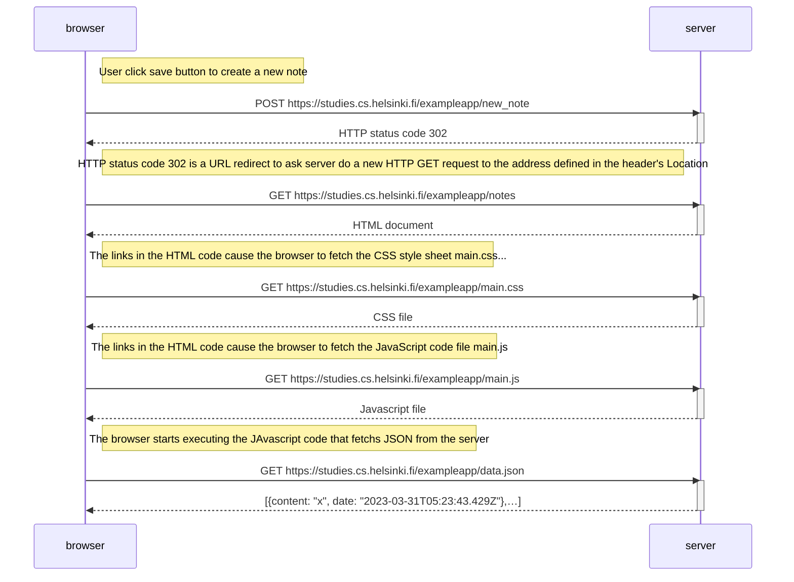

exercise 0.4

```mermaid
sequenceDiagram
Note right of browser: User click save button to create a new note
browser->>server: POST https://studies.cs.helsinki.fi/exampleapp/new_note
activate server
server-->>browser: HTTP status code 302
deactivate server 

Note right of browser: HTTP status code 302 is a URL redirect to ask server do a new HTTP GET request to the address defined in the header's Location
browser->>server: GET https://studies.cs.helsinki.fi/exampleapp/notes
activate server
server-->>browser: HTML document
deactivate server

Note right of browser: The links in the HTML code cause the browser to fetch the CSS style sheet main.css...
browser->>server: GET https://studies.cs.helsinki.fi/exampleapp/main.css
activate server
server-->>browser: CSS file
deactivate server

Note right of browser: The links in the HTML code cause the browser to fetch the JavaScript code file main.js
browser->>server: GET https://studies.cs.helsinki.fi/exampleapp/main.js
activate server
server-->>browser: Javascript file
deactivate server

Note right of browser: The browser starts executing the JAvascript code that fetchs JSON from the server
browser->>server: GET https://studies.cs.helsinki.fi/exampleapp/data.json
activate server
server-->>browser: [{content: "x", date: "2023-03-31T05:23:43.429Z"},…]
deactivate server
```