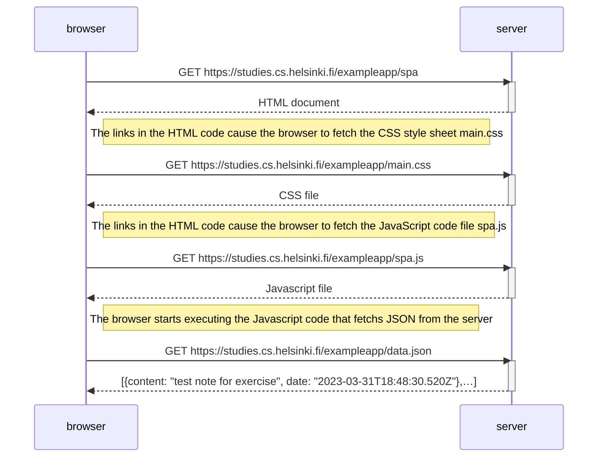

exercise 0.5

```mermaid
sequenceDiagram
browser->>server: GET https://studies.cs.helsinki.fi/exampleapp/spa
activate server
server-->>browser: HTML document
deactivate server

Note right of browser: The links in the HTML code cause the browser to fetch the CSS style sheet main.css
browser->>server: GET https://studies.cs.helsinki.fi/exampleapp/main.css
activate server
server-->>browser: CSS file
deactivate server

Note right of browser: The links in the HTML code cause the browser to fetch the JavaScript code file spa.js
browser->>server: GET https://studies.cs.helsinki.fi/exampleapp/spa.js
activate server
server-->>browser: Javascript file
deactivate server

Note right of browser: The browser starts executing the Javascript code that fetchs JSON from the server
browser->>server: GET https://studies.cs.helsinki.fi/exampleapp/data.json
activate server
server-->>browser: [{content: "test note for exercise", date: "2023-03-31T18:48:30.520Z"},…]
deactivate server
```