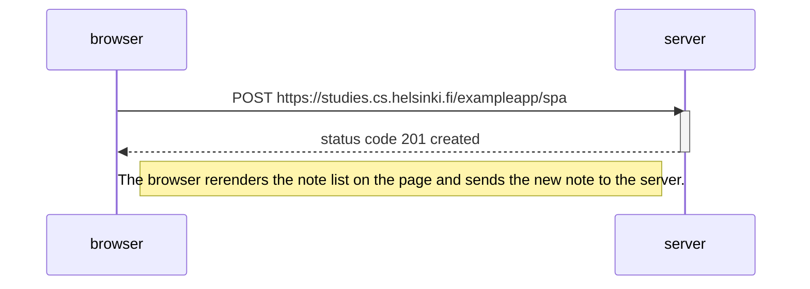

exercise 0.6

```mermaid
sequenceDiagram
browser->>server: POST https://studies.cs.helsinki.fi/exampleapp/spa
activate server
server-->>browser: status code 201 created
deactivate server
Note right of browser: The browser rerenders the note list on the page and sends the new note to the server.
```
